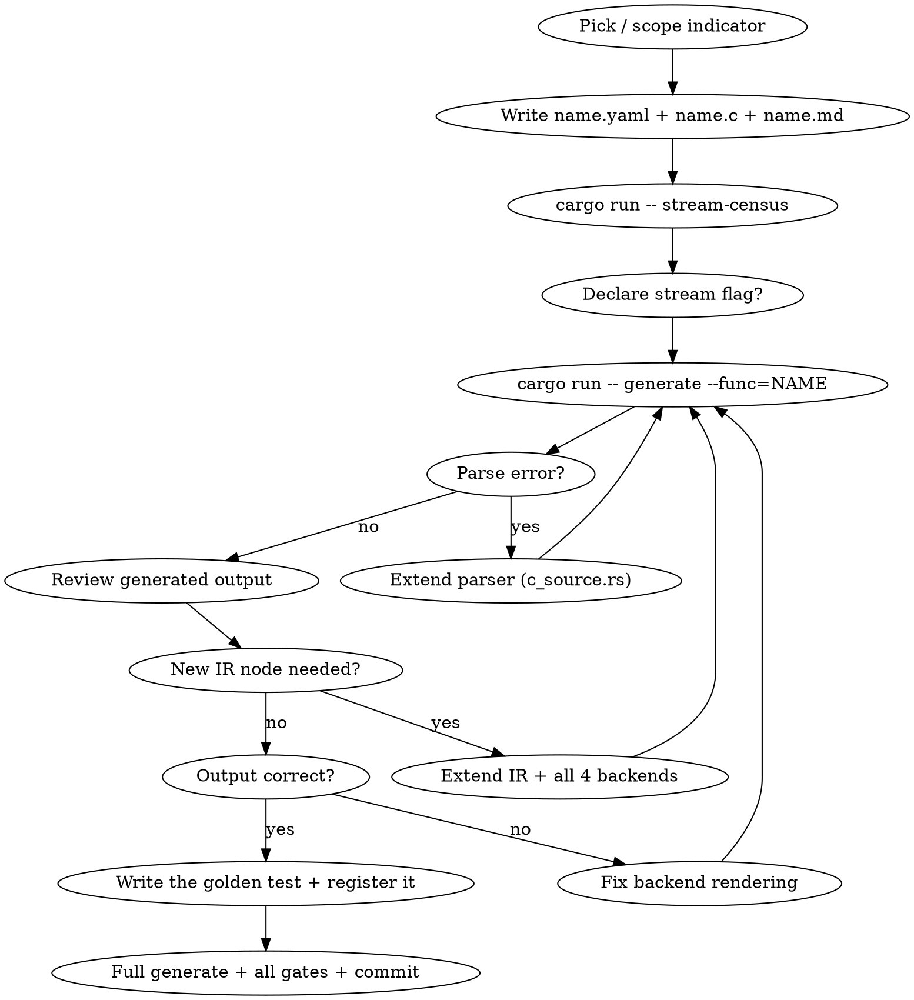

# Add / Modify a TA Function via ta_codegen

`ta_codegen` (Rust, in `ta_codegen/generator/`) is the single code generator. Each
function is defined by three files in `ta_codegen/input/<name>/`:

- `<name>.yaml` — metadata (inputs, optional params, outputs, group, flags)
- `<name>.c` — the algorithm, written as plain C (see `docs/ta_codegen_input_code.md`)
- `<name>.md` — documentation prose (see `docs/ta_codegen_input_doc.md`)

From these it generates all **four** backends: **C** (in place under `src/ta_func` /
`src/ta_abstract`), **Rust**, **Java**, **C#** (under `ta_codegen/output/`) — plus, from
`<name>.md` alone, the website function page, the Rust rustdoc, the Java Javadoc and the
C# XML doc comments.

> Use this skill to **add a brand-new** function, **modify** an existing one, or
> **extend the generator** to support a new C construct. The correctness baseline is
> the frozen pre-cutover reference (the `reference-pre-cutover` tag, served as
> `ta_ref_serve`) plus ta_regtest's hardcoded expected values.
>
> **`website/src/contribute/README.md` owns the process and the invariants** — spec
> approval, golden-value sourcing, the "Invariants / violating any of these fails
> review" list, and the definition of done. Read it; do not re-derive it from here.
> This file covers only what that page does not: the generator's internals and the
> in-tree iteration loop.

## Usage

- `/new-ta-func BBANDS` — work on a specific function
- `/new-ta-func` — resume in-progress work

## Workflow



## Step-by-step

### 1. Find / scope the indicator

```bash
ls ta_codegen/input/                 # existing definitions
ls ta_codegen/input/<name>/          # the target's .yaml + .c (if it already exists)
```

### 2. Write / adjust the metadata — `ta_codegen/input/<name>/<name>.yaml`

Full schema in `docs/ta_codegen_input_yaml.md`. The shipped SMA metadata, verbatim:

```yaml
name: SMA
group: Overlap Studies
hint: Simple Moving Average
flags: [overlap, stream, period1_identity]
inputs:
  - name: inReal
    type: real
optional_inputs:
  - name: optInTimePeriod
    type: integer
    display_name: Time Period
    hint: Time period
    range: [1, 100000]
    default: 30
    suggested: [1, 200, 1]
outputs:
  - name: outReal
    type: real
    flags: [line]
```

There is **no `lookback:` field** — lookback is a C function in the `.c` file (below).
Use `hint:` for the short description (not `description:`). The parser is
`#[serde(deny_unknown_fields)]`, so a stray key is a hard failure, and the directory
name must equal `name` lower-cased.

`flags:` are per-function claims, not boilerplate — `period1_identity` asserts that
period 1 returns the input unchanged; copy neither it nor any other flag without
checking it holds.

**Decide `stream` deliberately.** It generates the streaming API (Open/Update/Peek/…)
in all four languages, **every shipped function declares it**, and it fails open in
both directions:

- **Omit it** and you silently ship the corpus's only batch-only function. Nothing
  catches that: the generator's corpus check
  (`ta_codegen/generator/tests/streaming_suite.rs`) only validates functions that
  already declare the flag, and asserts a floor rather than a total; ta_regtest's
  flag-vs-server check sees both sides agree that there is no stream. In Java it is
  worse than silent — `StreamSmokeTest` sweeps the metadata registry for a
  `<NAME>_Open` on every registered function, so a batch-only function reddens the
  Java build with a message that names nothing to do with your change.
- **Declare it** and you arm a hard gate: `generate` runs `validate_streamable` once
  per language and **`exit(1)`s** if the body's IR shape is not analyzable.

So ask the generator before authoring the flag:

```bash
cd ta_codegen/generator
cargo run -- stream-census        # one line per function: derived tier + state size.
                                  # "candidate" = analyzes clean, not yet declared;
                                  # "streamed" = declared; "MISMATCH" = declared but broken
```

The tier is **derived, never declared** — there is no `tier:` key. If your function
comes back a candidate, declare `stream`. If it does not analyze clean, raise it on
the spec issue rather than quietly dropping the flag; the usual fix is to match a
shipped input file's loop shape (`docs/streaming-api-design.md`).

### 3. Write / adjust the logic — `ta_codegen/input/<name>/<name>.c`

Plain C, exactly as it would appear in `src/ta_func`: two functions,
`int <name>_lookback(...)` and
`TA_RetCode <name>(int startIdx, int endIdx, const double inReal[], ..., int *outBegIdx, int *outNBElement, double outReal[])`.
Full syntax and the `ta_defs.h` vocabulary (`TA_IS_ZERO`,
`TA_GetUnstablePeriod(TA_FUNC_UNST_X)`, `CIRCBUF_*`, …) are in
`docs/ta_codegen_input_code.md`, which marks the constructs closed to new functions.

**Rules** (the full invariant list is on the contribute page; these are the ones that
bite while authoring the `.c`):

- A complete C function: full signature, `TA_RetCode` return, pointer/array outputs
  (`*outBegIdx = ...`, `outReal[outIdx] = ...`), `return TA_SUCCESS;`
- Do **not** write parameter validation — the generator adds it
- Cross-indicator calls use the **bare lowercase name** (`sma(...)`,
  `ema_lookback(...)`); the generator resolves them per language
- The output array may **alias an input** — `outReal == inClose` is a supported,
  tested calling convention. Within a bar, read every input value you need *before*
  writing that bar's output; a trailing index can reach the slot you just wrote, so
  carry what you need in a scalar. `ta_regtest`'s in-place alias gate (issue #130)
  checks every (input, output) pair bitwise on every function.
- Do **not** honour `TA_SetCompatibility`. The constants are preserved for the
  functions that already read one, and the Rust, Java and C# APIs expose no such
  setting — a new function that branches on it makes its C output diverge from three
  backends that cannot reach the branch. Copying an EMA-shaped function hands you a
  `TA_MA_METASTOCK` seeding arm; drop it.
- Open the file with the contributor / change-history comment block (copy its shape
  from `ta_codegen/input/cmf/cmf.c`): add your initials and a one-line `MMDDYY` entry.
  Do **not** add a license header — the generator injects the BSD-3-Clause notice into
  every generated file, and no input file carries one.

### 4. Write / adjust the documentation — `ta_codegen/input/<name>/<name>.md`

The canonical prose source: summary, the formula in its **original algebraic form**
(never implementation artifacts — no zero-guards, epsilons or `period == 1` cases),
inputs/outputs, references. Rendered into four targets — the website function page,
the Rust rustdoc (including a runnable doctest), the Java Javadoc and the C# XML doc
comments — so the four cannot describe the same function differently. The C# ones are
load-bearing on the build: `TALib.csproj` sets `GenerateDocumentationFile` +
`TreatWarningsAsErrors`, so a public member without a `<summary>` (CS1591) or a
mis-named `<param>` (CS1572/CS1573) fails the library build. Numbers live in the YAML
and are injected at render time — never restate a range or default in prose. Schema
and gated sections in `docs/ta_codegen_input_doc.md`.

### 5. Generate and iterate

```bash
cd ta_codegen/generator
cargo run --release -- generate --func=<NAME>
cargo test
```

`--func=` is the **iteration loop only**. It deliberately skips every whole-corpus
file — the shipped `Core.java` splice, the Java metadata registry, the JSON-RPC
servers, the C benches — and says so on stdout. A tree generated that way is stale
and fails the PR gate; step 6 closes it. Note also that a full `generate` piped into
`head`/`less` is SIGPIPE-killed mid-write and deletes hundreds of tracked files:
redirect to a file instead.

If the parser panics or output is wrong, extend:

| Missing | Where |
|---|---|
| New statement type | `ir.rs` + `parser/c_source.rs` + all 4 backends |
| New expression type | `ir.rs` + `parser/c_source.rs` + all 4 backends |
| New builtin / macro | `backends/builtins.rs` + each backend's render |
| New type keyword | `parser/c_source.rs` + backends |
| New variable mapping | the `Expr::Var` leaf hook in each backend's `ExprEmitter` |

**When extending the IR you MUST update ALL 4 backends** (C, Rust, Java, C#) — the
shared walkers' matches are exhaustive with no wildcard arm, so Rust points you at each.

### 6. Write the regression test — and register it in four places

**A brand-new function is verified by nothing until you do this**, and both halves of
the obvious command are vacuous:

- `--function=<NAME>` substring-matches **DO_TEST tag strings**, not function names.
  A name in no tag runs zero test groups and exits **0**.
- The generic `--codegen` sweep marks the function *skipped* — it diffs against the
  frozen `ta_ref_serve`, which predates it — and runs only the self-comparing float
  leg.

So: write a golden-value test (`src/tools/ta_regtest/ta_test_func/test_composite.c` is
the pattern for a composite; `test_marketfi.c` for a standalone file), with values from
an independent source, documenting the source, its version and the tolerance at the
call site. Then register it:

1. a prototype in `src/tools/ta_regtest/ta_test_func.h`;
2. a `DO_TEST` entry in `src/tools/ta_regtest/ta_regtest.c` whose **tag string names
   your function** — that string is what `--function=` matches (issue #137);
3. **and, only if you added a new `.c` file**, the file in *both* `CMakeLists.txt`
   (`TA_REGTEST_SOURCES`, the hand-maintained block — not the generated `LIB_SOURCES`
   region) and `src/tools/ta_regtest/Makefile.am`. The autotools list is what the dist
   nightly builds; `scripts/build.py check-source-lists` catches a one-sided edit.

Cross-language checking is also **not** automatic. Wrap each golden call site in
`if( server_verify_active() ) { … server_verify( "<NAME>", … ); }` (declared in
`src/tools/ta_regtest/server_verify.h`; `test_cmf.c` is the exemplar) —
it replays that exact call on all four language servers and compares bit-for-bit.
It is inert without `--codegen`, so adding it costs a bare run nothing.

Add the CHANGELOG entry too: one bullet under `### Added` → `- New TA Functions:`,
formatted `  - NAME: Human name, short clause (#NNN)`.

### 7. Full generate, all gates, commit

```bash
scripts/build.py format          # regen-check runs `format --check` first and hard-fails
scripts/build.py generate        # FULL, unfiltered — writes what --func= skipped
scripts/build.py servers         # note: this runs generate-servers only, not generate
cd bin && ./ta_regtest --function=<NAME>              # your hand-written legs
cd bin && ./ta_regtest --codegen --function=<NAME>    # + server_verify, all four languages
cd bin && ./ta_regtest --xlang-hash --function=<NAME> # the zero-tolerance bitwise gate
scripts/build.py check-source-lists
scripts/build.py regen-check     # THE PR GATE: regenerating must change nothing
scripts/build.py clippy          # -D warnings over BOTH crates, incl. the generated one
cd ta_codegen/generator && cargo test
cargo test --doc -p ta-lib --manifest-path ta_codegen/output/rust/Cargo.toml
cargo test --lib -p ta-lib --manifest-path ta_codegen/output/rust/Cargo.toml
```

`--codegen` needs `bin/ta_ref_serve`; on a fresh clone build it via `scripts/regtest.py`.

Things that are easy to get wrong here:

- `regen-check` is what `.github/workflows/pr-codegen-gate.yml` runs on **every** pull
  request. `scripts/build.py servers` does not satisfy it: it regenerates the servers
  but not the shipped `Core.java`, the Java metadata registry or the C benches. The gap
  is silent locally, because the Java JSON-RPC server compiles its own inline `class
  Core` — `--codegen --language=java` stays green while the shipped `Core.java` has no
  such method.
- None of the Rust gates is visible to `ta_regtest` or `scripts/regtest.py`, and your
  function adds code to each: its Rust lands in the clippy'd crate, and its `.md`
  emits a runnable doctest that clippy does not build. `-D warnings` is not optional —
  without it a local run prints the lints and still exits 0.
- Some `cargo test` cases are **inventories** keyed on a function's properties. A
  failure naming your function in a test you never touched is the inventory asking to
  be updated, not a regression.
- `git diff` the other backends' generated output. The `--codegen` sweep compares every
  function against the frozen reference at a 1e-9 element-wise tolerance — nothing is
  compared bit-exactly there. Bit-identical parity is the separate, corpus-wide
  `--xlang-hash`. Run the sweep once without `--function=` before committing: any
  function you did not touch that moves is a real regression.

## Key files

| File | Purpose |
|------|---------|
| `ta_codegen/input/<name>/<name>.yaml` | Metadata: inputs, outputs, params, flags |
| `ta_codegen/input/<name>/<name>.c` | Algorithm (plain C) |
| `ta_codegen/input/<name>/<name>.md` | Documentation (canonical prose source) |
| `ta_codegen/generator/src/ir.rs` | IR types (FuncDef, Statement, Expr, ParamType) |
| `ta_codegen/generator/src/parser/c_source.rs` | C-source → IR parser |
| `ta_codegen/generator/src/parser/yaml.rs` | YAML metadata parser |
| `ta_codegen/generator/src/backends/*.rs` | Backends (c, rust_lang, java, csharp) |
| `ta_codegen/generator/src/backends/stmt_walk.rs` | The one exhaustive `Statement` walk |
| `ta_codegen/generator/src/backends/expr_walk.rs` | The one exhaustive `Expr` walk |
| `ta_codegen/generator/src/streaming.rs` | Tiers, `StreamPlan`, `validate_streamable` |
| `ta_codegen/generator/src/server_gen.rs` | JSON-RPC server generation |
| `ta_codegen/generator/tests/validate.sh` | Dev validation harness |
| `docs/ta_codegen_input_yaml.md` | YAML schema reference |
| `docs/ta_codegen_input_code.md` | `.c` logic / `ta_defs.h` macro reference |
| `docs/ta_codegen_input_doc.md` | `.md` documentation reference |
| `docs/streaming-api-design.md` | Streaming tiers and what makes a body analyzable |
| `website/src/contribute/README.md` | Process, invariants, definition of done |

## Backend rendering

Two shared tree-walkers own the variant dispatch; each backend supplies only the
per-variant leaf formatting.

- **`StatementEmitter`** (`backends/stmt_walk.rs`) — `walk_stmt()` holds the one
  exhaustive `Statement` match (VarDecl, Assign, While, If, Switch, …) and threads
  `indent`. Leaf hooks: `CStmt` (`c.rs`), `RustStmt` (`rust_lang.rs`), `JavaStmt`
  (`java.rs`), `CsStmt` (`csharp.rs`).
- **`ExprEmitter`** (`backends/expr_walk.rs`) — `walk()` holds the one exhaustive
  `Expr` match (Var, Literal, BinOp, Cast, FuncCall, …). Leaf hooks: `CExpr`,
  `RustExpr`, `JavaExpr`, `CsExpr`.
- The `render_statement` / `render_statement_ctx` / `render_expr` functions are thin
  wrappers that bundle the backend's render context and call the walker. C, Rust and
  Java expose `render_statement()`; **C# has only `render_statement_ctx()`**. C's
  public expression entry point is `render_expression()`.
- builtins + cross-indicator dispatch (`backends/builtins.rs` + per-backend resolution)

**Cross-call dispatch per language** (a bare `sma(...)` in the `.c` file):

| Call in `<name>.c` | C | Rust | Java | C# |
|---|---|---|---|---|
| `sma(...)` | `TA_SMA(...)` | `self.SMA(...)` | `SMA_Internal(...)` | `SMA(...)` |
| `sma_lookback(...)` | `TA_SMA_Lookback(...)` | `self.SMA_Lookback(...)` | `SMA_Lookback(...)` | `SMA_Lookback(...)` |

(C also emits single-precision `TA_S_*` variants automatically; there is no Rust `_s`
variant — Rust is concrete `f64`.)

## Complexity tiers (reference order of increasing difficulty)

| Tier | Example | Features |
|---|---|---|
| Simple loop | MULT | while, assign, array access |
| Accumulator | SMA | if/else, return, cast, running sum |
| Stateful | RSI | `TA_GetUnstablePeriod`, `TA_IS_ZERO`, for-loop, complex lookback |
| Recursive | EMA | k factor, seeded recursion, operator precedence (its `TA_COMPATIBILITY_*` arm is legacy-only — do not copy it) |
| Dispatcher | MA | switch/case, cross-call dispatch, `TA_BAD_PARAM`/`TA_SUCCESS` |
| Multi-output | BBANDS | multiple output arrays |
