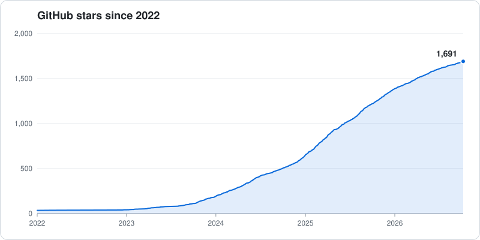

# TA-Lib

Technical analysis for price series: indicators such as RSI, MACD, ADX and
Bollinger Bands, and candlestick pattern recognition. Used in production
since 2001.

TA-Lib Core is the C library plus native Java, C# and Rust implementations,
all generated from one source and tested against the C reference.

[](https://github.com/TA-Lib/ta-lib/releases)
[](LICENSE)
[](https://github.com/TA-Lib/ta-lib/actions/workflows/main-nightly-tests.yml)
[](https://github.com/TA-Lib/ta-lib/actions/workflows/dev-nightly-tests.yml)
[](https://discord.gg/Erb6SwsVbH)

## Features

- Batch and streaming API for every function: compute a whole array, or update
  one bar at a time without recomputing the history.
- Native libraries for C/C++, Rust, Java and C#. The Rust, Java and C# ones do
  not need the C library.
- Made for integration and glue-code friendly. Function metadata drives your
  UI, parameter range, automation and generated bindings; the
  [Abstract API](https://ta-lib.org/api/abstract/) calls any function by name.
  New functions show up with an upgrade, with no code change.
- No third-party dependencies.

## Example

A 30-bar simple moving average, over an array and then on a live feed.

<details>
<summary>C/C++</summary>

```c
#include <ta_libc.h>

TA_Initialize();

/* Batch: out[0] is the value at bar outBegIdx. */
int outBegIdx, outNBElement;
TA_SMA( 0, n - 1, close, 30, &outBegIdx, &outNBElement, out );

/* Streaming: open on history, then one call per bar. */
TA_SMA_Stream *s;
double sma;
TA_SMA_Open( &s, close, n, 30, &sma );
TA_SMA_Update( s, newClose, &sma );     /* a bar closed */
TA_SMA_Peek( s, formingClose, &sma );   /* bar still forming; state unchanged */
TA_SMA_Close( s );
```

[API](https://ta-lib.org/api/) · [Streaming](https://ta-lib.org/api/stream/)

</details>

<details>
<summary>Rust</summary>

```rust
use ta_lib::Core;

let core = Core::new();

// Batch: out[0] is the value at bar range.beg_idx.
let mut out = vec![0.0; close.len()];
let range = core.sma(0, close.len() - 1, &close, 30, &mut out)?;

// Streaming: open on history, then one call per bar.
let (mut s, last) = core.sma_open(&close, 30)?;
let v = s.update(new_close)?;        // a bar closed
let p = s.peek(forming_close)?;      // bar still forming; state unchanged
```

[API](https://ta-lib.org/api/rust/) · [Streaming](https://ta-lib.org/api/rust/stream/)

</details>

<details>
<summary>Java</summary>

```java
import io.github.talib.Core;
import io.github.talib.OutRange;

Core core = Core.DEFAULT;

// Batch: out[0] is the value at bar r.begIdx().
double[] out = new double[close.length];
OutRange r = core.sma(0, close.length - 1, close, 30, out);

// Streaming: open on history, then one call per bar.
Core.SmaStream s = core.smaOpen(close, 30);
double v = s.update(newClose);       // a bar closed
double p = s.peek(formingClose);     // bar still forming; state unchanged
```

[API](https://ta-lib.org/api/java/) · [Streaming](https://ta-lib.org/api/java/stream/)

</details>

<details>
<summary>C#</summary>

```csharp
using TALib;

var core = Core.Default;

// Batch: outReal[0] is the value at bar r.BegIdx.
var outReal = new double[close.Length];
OutRange r = core.Sma(0, close.Length - 1, close, 30, outReal);

// Streaming: open on history, then one call per bar.
Core.SmaStream s = core.SmaOpen(close, 30);
double v = s.Update(newClose);       // a bar closed
double p = s.Peek(formingClose);     // bar still forming; state unchanged
```

[API](https://ta-lib.org/api/csharp/) · [Streaming](https://ta-lib.org/api/csharp/stream/)

</details>

## Install

| Language | |
|---|---|
| C/C++ | `brew install ta-lib`, `vcpkg install talib`, or [installers and packages](https://ta-lib.org/install/c/) |
| Java | [Maven Central](https://central.sonatype.com/artifact/io.github.ta-lib/ta-lib) |
| C# | [Instructions](https://ta-lib.org/api/csharp/) |
| Rust | [Instructions](https://ta-lib.org/api/rust/) |
| Python | `pip install TA-Lib` ([ta-lib-python](https://github.com/TA-Lib/ta-lib-python), a wrapper of this library) |
| Others | [R, Go, Ruby, PHP and more](https://ta-lib.org/install/#wrappers) |

## Links

- Website and docs: https://ta-lib.org
- Function list: https://ta-lib.org/functions/
- Request a function: [New TA Functions board](https://github.com/orgs/TA-Lib/projects/1)
- Contribute: [CONTRIBUTING.md](CONTRIBUTING.md)
- Report a vulnerability: [SECURITY.md](SECURITY.md)

## License

BSD 3-Clause: free for open-source and commercial use. See [LICENSE](LICENSE).

## Star Count

**Give a** ⭐: backtests show a 100% correlation with maintainer happiness.

[](https://github.com/TA-Lib/ta-lib/stargazers)
