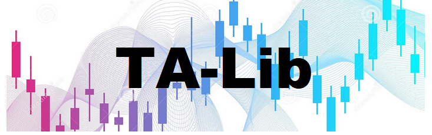

---
hide:
  - navigation
  - toc
---
#
<figure markdown>
  
</figure>
<h3 align="center">Use TA-Lib to add technical analysis to your own financial market trading applications</h3>

* 200 indicators such as ADX, MACD, RSI, Stochastic, Bollinger Bands etc... [:octicons-arrow-right-24: See complete list...](functions.md)
 
* Candlestick patterns recognition

* Core written in [C/C++](api.md) with API also available for [Python](wrappers.md).

* Open-Source (BSD License). Can be freely integrated in your own open-source or commercial applications.

TA-Lib was release in 2001 for well-known algorithms that are still widely used >20 years later. The code is stable and have passed the test of time. 
